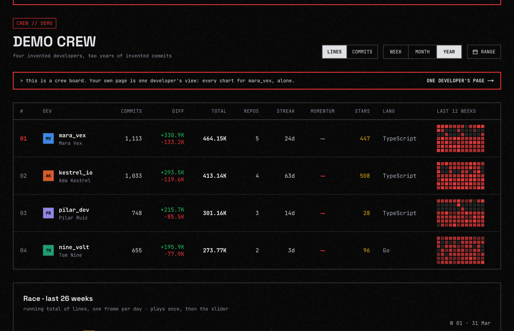

# gitstats

Compare coding activity with friends. Private and work repos are counted on your own computer; only numbers leave it.

[](https://gitstats.org/demo)

**Try it: [gitstats.org](https://gitstats.org)** · **See a board: [gitstats.org/demo](https://gitstats.org/demo)**

[](https://gitstats.org/gh/yaroslavhaidash)

## Features

- **Crews.** Sign in with GitHub, share an invite code, and your friends land on one board.
- **Lines or commits, week, month or year.** Pick a metric and a window; the board and every chart follow it.
- **Private and work repos count too.** A small CLI counts your commits locally and sends numbers only; repo names stay on your computer unless you opt in.
- **Your own page.** Daily lines, a year calendar, streaks, the repos you worked in, and how you compare to last period.
- **Streaks your way.** Choose what counts as a streak day.
- **You choose who sees what.** Separate settings for your crews and for everyone, and any repo name can be hidden.
- **Share it.** A share card for chats and a badge for your GitHub profile.
- **Ask your AI assistant.** A read-only MCP server lets Claude Code, Codex or Cursor answer "how was my week" from your numbers. Setup: [gitstats.org/docs#mcp](https://gitstats.org/docs#mcp).
- **Open source, MIT.** The server and the CLI; self-host it if you like.

## Put it in your README

```markdown
[](https://gitstats.org/gh/YOUR-LOGIN)
```

Pick a window and copy your own snippet at [gitstats.org/widget](https://gitstats.org/widget).

## How privacy works

- Sign-in asks GitHub for your public profile and email only. It never asks for the `repo` scope.
- The GitHub access token is not stored. Public activity is read at night with a server token that has no scopes.
- Private and work repos are counted by a small CLI on your computer. It sends numbers: lines, commits, a language.
- Repo names stay on your computer unless you turn them on with `gitstats names on`.
- You decide what your crews and everyone else can see, and you can export or delete everything at any time.

More: [gitstats.org/privacy](https://gitstats.org/privacy) and [docs/PRIVATE-ACTIVITY.md](docs/PRIVATE-ACTIVITY.md).

## Run it locally

You need a free Neon database, a GitHub OAuth App and a GitHub token with no scopes. Then:

```bash
cp .env.example .env.local          # fill it in; each line says where the value comes from
npm ci
npm run db:migrate
npx tsx --env-file=.env.local scripts/seed-demo.ts
npm run dev
```

Open http://localhost:3000/demo to see every chart with fake data.

Step-by-step setup, environment variables, self-hosting and known limits: [docs/SELF-HOSTING.md](docs/SELF-HOSTING.md).

## Links

- Live: [gitstats.org](https://gitstats.org)
- CLI: [github.com/yaroslavhaidash/gitstats-cli](https://github.com/yaroslavhaidash/gitstats-cli)
- How it fits together: [docs/ARCHITECTURE.md](docs/ARCHITECTURE.md)
- Where it is heading: [ROADMAP.md](ROADMAP.md)
- Contributing: [CONTRIBUTING.md](CONTRIBUTING.md)
